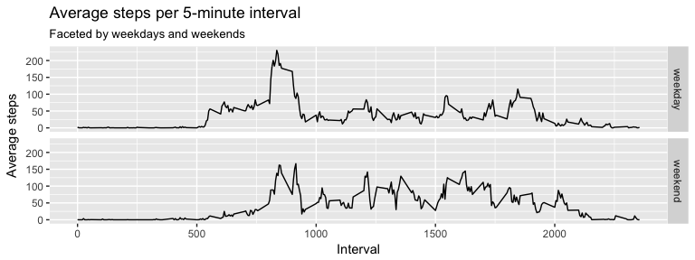

## Make sure all libraries are available

### 1. see what's there


```r
available_packages <- installed.packages()

dplyr_installed <- "dplyr" %in% available_packages
ggplot2_installed <- "ggplot2" %in% available_packages
```

### 2. install what's missing

Since `knitr` produces a new R session, it won't know which CRAN mirror to use, so we need to specify it.
(This will be taken of automatically by i.e. RStudio sessions.)


```r
CRAN_MIRROR <- "http://cran.us.r-project.org"

if(!dplyr_installed) { install.packages("dplyr", repos=CRAN_MIRROR) }
if(!ggplot2_installed) { install.packages("ggplot2", repos=CRAN_MIRROR) }
```

## Loading and preprocessing the data

### 1. Load the data (i.e. read_csv())

First, unzip the archive and read the resulting .csv into a variable.


```r
unzip("activity.zip")
data <- read.csv("activity.csv")
```

Then have a look at our data.


```r
  print(head(data))
```

```
##   steps       date interval
## 1    NA 2012-10-01        0
## 2    NA 2012-10-01        5
## 3    NA 2012-10-01       10
## 4    NA 2012-10-01       15
## 5    NA 2012-10-01       20
## 6    NA 2012-10-01       25
```

And get a feeling for the values.


```r
  print(summary(data))
```

```
##      steps                date          interval     
##  Min.   :  0.00   2012-10-01:  288   Min.   :   0.0  
##  1st Qu.:  0.00   2012-10-02:  288   1st Qu.: 588.8  
##  Median :  0.00   2012-10-03:  288   Median :1177.5  
##  Mean   : 37.38   2012-10-04:  288   Mean   :1177.5  
##  3rd Qu.: 12.00   2012-10-05:  288   3rd Qu.:1766.2  
##  Max.   :806.00   2012-10-06:  288   Max.   :2355.0  
##  NA's   :2304     (Other)   :15840
```

Well... quite a bunch of NAs.

### 2. Process/transform the data (if necessary) into a format suitable for your analysis

O.k., let's see, what kind of columns we have gotten


```r
sapply(data, class)
```

```
##     steps      date  interval 
## "integer"  "factor" "integer"
```

Hmmm... I think it would be nice to have `interval` also as a factor variable, since it's a kind of identifier for the interval during the day, so let's do this. And it would also be nice to have `date` as a Date.


```r
data$interval_id <- as.factor(data$interval)
data$date <- as.Date(data$date)
```

```
## Warning in strptime(xx, f <- "%Y-%m-%d", tz = "GMT"): unknown timezone
## 'zone/tz/2018c.1.0/zoneinfo/Europe/Berlin'
```

```r
sapply(data, class)
```

```
##       steps        date    interval interval_id 
##   "integer"      "Date"   "integer"    "factor"
```

That looks a lot better.

## What is mean total number of steps taken per day?

### 1. Calculate the total number of steps taken per day

We will use the `dplyr` package, since it makes the code really nice to read.


```r
library(dplyr)
```

```
## 
## Attaching package: 'dplyr'
```

```
## The following objects are masked from 'package:stats':
## 
##     filter, lag
```

```
## The following objects are masked from 'package:base':
## 
##     intersect, setdiff, setequal, union
```

```r
steps_per_day <- data %>% 
  group_by(date) %>% 
  summarise(total_steps = sum(steps))

print(steps_per_day)
```

```
## # A tibble: 61 x 2
##    date       total_steps
##    <date>           <int>
##  1 2012-10-01          NA
##  2 2012-10-02         126
##  3 2012-10-03       11352
##  4 2012-10-04       12116
##  5 2012-10-05       13294
##  6 2012-10-06       15420
##  7 2012-10-07       11015
##  8 2012-10-08          NA
##  9 2012-10-09       12811
## 10 2012-10-10        9900
## # ... with 51 more rows
```

### 2. If you do not understand the difference between a histogram and a barplot, research the difference between them. Make a histogram of the total number of steps taken each day

We'll use `ggplot2` to do this.


```r
library(ggplot2)

na_plot <- ggplot(
  data=steps_per_day,
  aes(
    steps_per_day$total_steps
  )
) +
  geom_histogram() +
  ggtitle("Histogram of steps taken per day") +
  xlab("Steps taken per day") +
  ylab("Frequency")  
```


```r
na_plot
```

```
## `stat_bin()` using `bins = 30`. Pick better value with `binwidth`.
```

```
## Warning: Removed 8 rows containing non-finite values (stat_bin).
```

<!-- -->

### 3. Calculate and report the mean and median of the total number of steps taken per day


```r
mean_steps <- mean(steps_per_day$total_steps, na.rm=TRUE)
median_steps <- median(steps_per_day$total_steps, na.rm=TRUE)

print(sprintf("Mean: %f", mean_steps))
```

```
## [1] "Mean: 10766.188679"
```

```r
print(sprintf("Median: %d", median_steps))
```

```
## [1] "Median: 10765"
```

The mean is approx. 10766 and the median is 10765 - so it's actually very nice distribution around the median.

## What is the average daily activity pattern?

### 1. Make a time series plot (i.e. 𝚝𝚢𝚙𝚎 = "𝚕") of the 5-minute interval (x-axis) and the average number of steps taken, averaged across all days (y-axis)


```r
interval_averages <- data %>%
  group_by(interval) %>%
  summarise(average = mean(steps, na.rm=TRUE))

print(interval_averages)
```

```
## # A tibble: 288 x 2
##    interval average
##       <int>   <dbl>
##  1        0  1.72  
##  2        5  0.340 
##  3       10  0.132 
##  4       15  0.151 
##  5       20  0.0755
##  6       25  2.09  
##  7       30  0.528 
##  8       35  0.868 
##  9       40  0.    
## 10       45  1.47  
## # ... with 278 more rows
```

```r
plot <- ggplot(
  interval_averages,
  aes(x=interval, y=average)
) +
geom_line() +
xlab("Interval") +
ylab("Average steps") +
ggtitle("Average steps per 5-minute interval")
```


```r
plot
```

<!-- -->

### 2. Which 5-minute interval, on average across all the days in the dataset, contains the maximum number of steps?


```r
print(interval_averages[order(interval_averages$average, decreasing=TRUE),][1,])
```

```
## # A tibble: 1 x 2
##   interval average
##      <int>   <dbl>
## 1      835    206.
```

It's interval 835 with an average of about 206 steps.

## Imputing missing values

### 1. Calculate and report the total number of missing values in the dataset (i.e. the total number of rows with NAs


```r
print(count(data[is.na(data$steps),]))
```

```
## # A tibble: 1 x 1
##       n
##   <int>
## 1  2304
```

We've seen this already at the beginning in the summary - but here we get the same 2304 `NAs` - which is reassuring :)

### 2. Devise a strategy for filling in all of the missing values in the dataset. The strategy does not need to be sophisticated. For example, you could use the mean/median for that day, or the mean for that 5-minute interval, etc.

Since the number of steps taken during a given 5-minute interval changes dramatically over the course of the day, filling in the missing values by a simple mean over the day seems to introduce quite some distortion depending on the way we pull our stats (especially if we look at things related to specific 5-minute intervals). Therefore taking the mean for that 5-minute interval over all days with values seems to be a better approach, that should approximate a lot closer.

### 3. Create a new dataset that is equal to the original dataset but with the missing data filled in.


```r
# function to do the imputing
interval_average <- function(intervals) {
  return(
    rbind(sapply(
      intervals,
      function(the_interval) {
        value <- interval_averages[interval_averages$interval==the_interval,][[2]]
        return(value)
      }
    )
  ))
}


# we'll use dplyr's mutate to do this
imputed_data <- data %>%
  mutate(steps = ifelse(
    is.na(steps),
    as.integer(interval_average(interval)),
    steps
  ))

print(head(imputed_data))
```

```
##   steps       date interval interval_id
## 1     1 2012-10-01        0           0
## 2     0 2012-10-01        5           5
## 3     0 2012-10-01       10          10
## 4     0 2012-10-01       15          15
## 5     0 2012-10-01       20          20
## 6     2 2012-10-01       25          25
```

```r
print(summary(imputed_data))
```

```
##      steps             date               interval       interval_id   
##  Min.   :  0.00   Min.   :2012-10-01   Min.   :   0.0   0      :   61  
##  1st Qu.:  0.00   1st Qu.:2012-10-16   1st Qu.: 588.8   5      :   61  
##  Median :  0.00   Median :2012-10-31   Median :1177.5   10     :   61  
##  Mean   : 37.33   Mean   :2012-10-31   Mean   :1177.5   15     :   61  
##  3rd Qu.: 27.00   3rd Qu.:2012-11-15   3rd Qu.:1766.2   20     :   61  
##  Max.   :806.00   Max.   :2012-11-30   Max.   :2355.0   25     :   61  
##                                                         (Other):17202
```

Judging from these numbers, there is hardly any difference to the original data. Except the `NAs` are gone.

### 4. Make a histogram of the total number of steps taken each day and Calculate and report the mean and median total number of steps taken per day. Do these values differ from the estimates from the first part of the assignment? What is the impact of imputing missing data on the estimates of the total daily number of steps?


```r
library(grid)

imputed_steps_per_day <- imputed_data %>% 
  group_by(date) %>% 
  summarise(total_steps = sum(steps))

print(imputed_steps_per_day)
```

```
## # A tibble: 61 x 2
##    date       total_steps
##    <date>           <int>
##  1 2012-10-01       10641
##  2 2012-10-02         126
##  3 2012-10-03       11352
##  4 2012-10-04       12116
##  5 2012-10-05       13294
##  6 2012-10-06       15420
##  7 2012-10-07       11015
##  8 2012-10-08       10641
##  9 2012-10-09       12811
## 10 2012-10-10        9900
## # ... with 51 more rows
```

```r
imputed_mean_steps <- mean(imputed_steps_per_day$total_steps)
imputed_median_steps <- median(imputed_steps_per_day$total_steps)

print(sprintf("Mean (imputed): %f", imputed_mean_steps))
```

```
## [1] "Mean (imputed): 10749.770492"
```

```r
print(sprintf("Median (imputed): %d", imputed_median_steps))
```

```
## [1] "Median (imputed): 10641"
```

```r
imputed_steps_per_day <- imputed_data %>% 
  group_by(date) %>% 
  summarise(total_steps = sum(steps))

print(imputed_steps_per_day)
```

```
## # A tibble: 61 x 2
##    date       total_steps
##    <date>           <int>
##  1 2012-10-01       10641
##  2 2012-10-02         126
##  3 2012-10-03       11352
##  4 2012-10-04       12116
##  5 2012-10-05       13294
##  6 2012-10-06       15420
##  7 2012-10-07       11015
##  8 2012-10-08       10641
##  9 2012-10-09       12811
## 10 2012-10-10        9900
## # ... with 51 more rows
```

```r
imputed_plot <- ggplot(
  data=imputed_steps_per_day,
  aes(
    steps_per_day$total_steps
  )
) +
  geom_histogram() +
  ggtitle("Histogram of imputed steps taken per day") +
  xlab("Steps taken per day") +
  ylab("Frequency")


grid.newpage()
grid.draw(rbind(ggplotGrob(na_plot), ggplotGrob(imputed_plot), size="last"))
```

```
## `stat_bin()` using `bins = 30`. Pick better value with `binwidth`.
```

```
## Warning: Removed 8 rows containing non-finite values (stat_bin).
```

```
## `stat_bin()` using `bins = 30`. Pick better value with `binwidth`.
```

```
## Warning: Removed 8 rows containing non-finite values (stat_bin).
```

<!-- -->

The mean changed from 10766 to roughly 10750 (-0.15%) and the median from 10765 to 10641 (-0.04%). These changes to the mean/median values are negligible and the histogram also does not change in any significant/discernible way.

## Are there differences in activity patterns between weekdays and weekends?

### 1. Create a new factor variable in the dataset with two levels – “weekday” and “weekend” indicating whether a given date is a weekday or weekend day.


```r
imputed_data$weekend <- weekdays(imputed_data$date, abbreviate=TRUE) %in% c("Sat", "Sun")
imputed_data$weekend_label <- as.factor(ifelse(imputed_data$weekend, "weekend", "weekday"))

print(head(imputed_data))
```

```
##   steps       date interval interval_id weekend weekend_label
## 1     1 2012-10-01        0           0   FALSE       weekday
## 2     0 2012-10-01        5           5   FALSE       weekday
## 3     0 2012-10-01       10          10   FALSE       weekday
## 4     0 2012-10-01       15          15   FALSE       weekday
## 5     0 2012-10-01       20          20   FALSE       weekday
## 6     2 2012-10-01       25          25   FALSE       weekday
```

### 2. Make a panel plot containing a time series plot (i.e. 𝚝𝚢𝚙𝚎 = "𝚕") of the 5-minute interval (x-axis) and the average number of steps taken, averaged across all weekday days or weekend days (y-axis). See the README file in the GitHub repository to see an example of what this plot should look like using simulated data.


```r
daytype_interval_averages <- imputed_data %>%
  group_by(weekend_label, interval) %>%
  summarise(average = mean(steps, na.rm=TRUE))

print(daytype_interval_averages)
```

```
## # A tibble: 576 x 3
## # Groups:   weekend_label [?]
##    weekend_label interval average
##    <fct>            <int>   <dbl>
##  1 weekday              0  2.16  
##  2 weekday              5  0.400 
##  3 weekday             10  0.156 
##  4 weekday             15  0.178 
##  5 weekday             20  0.0889
##  6 weekday             25  1.58  
##  7 weekday             30  0.622 
##  8 weekday             35  1.02  
##  9 weekday             40  0.    
## 10 weekday             45  1.73  
## # ... with 566 more rows
```

```r
daytype_plot <- ggplot(
  daytype_interval_averages,
  aes(x=interval, y=average)
) +
facet_grid(weekend_label ~ .) +
geom_line() +
xlab("Interval") +
ylab("Average steps") +
labs(
  title="Average steps per 5-minute interval",
  subtitle="Faceted by weekdays and weekends"
)
```

```r
daytype_plot
```

<!-- -->

There is a slight difference in patterns, although the general shape of the step-series looks quite similar. As to be expected, people seem to be getting up a little bit later on the weekends compared to regular weekdays and they seem to be active slightly longer on the weekends.
